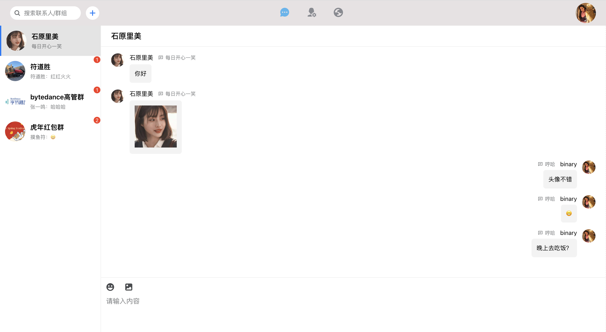
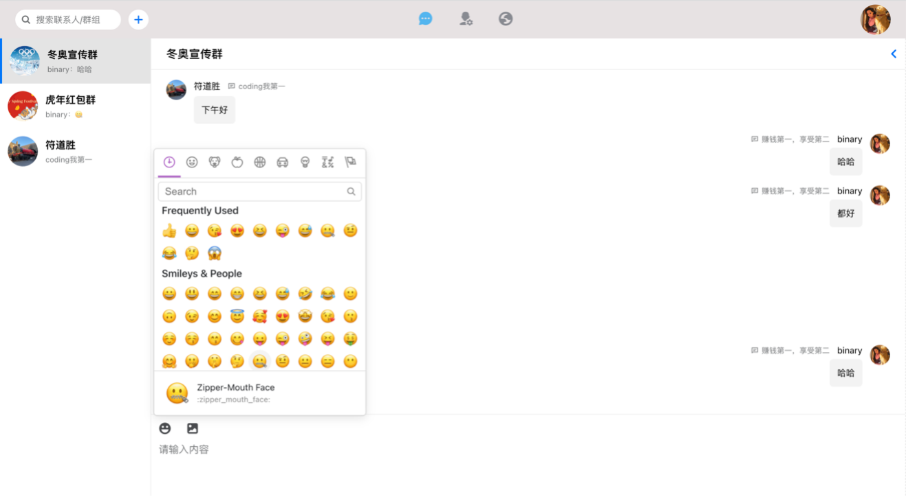
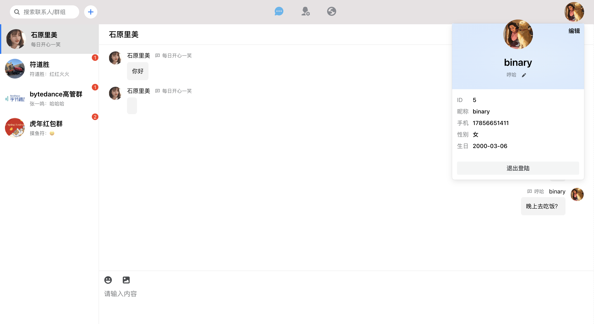
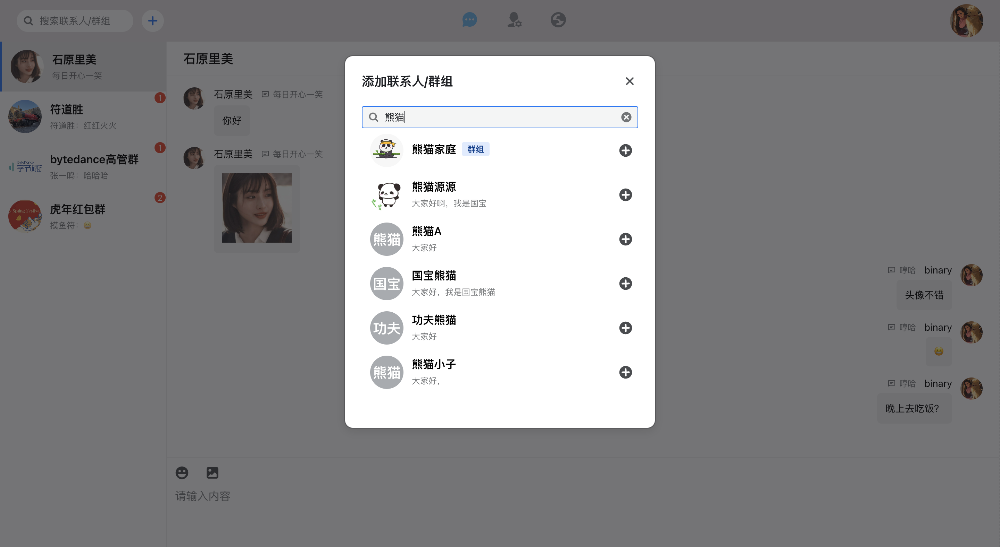
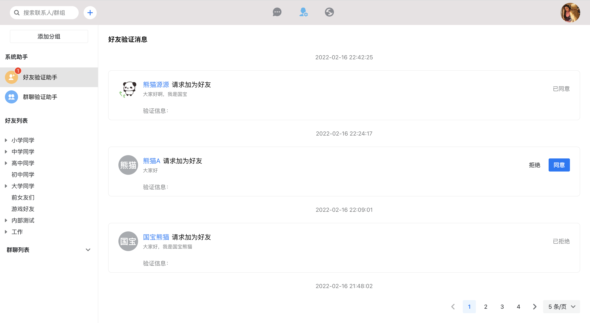
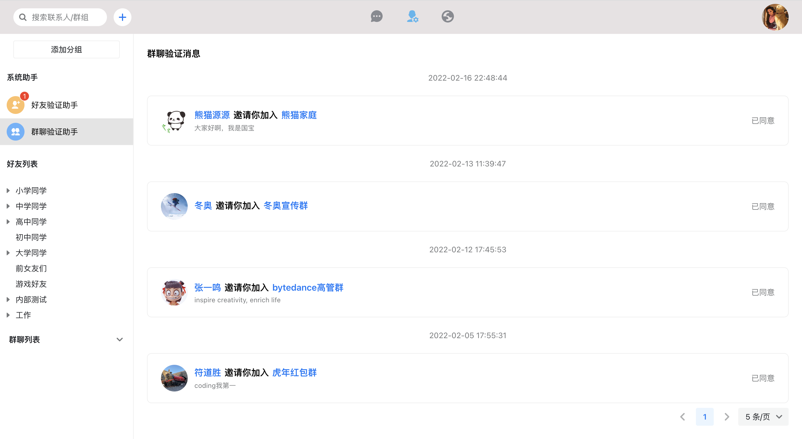
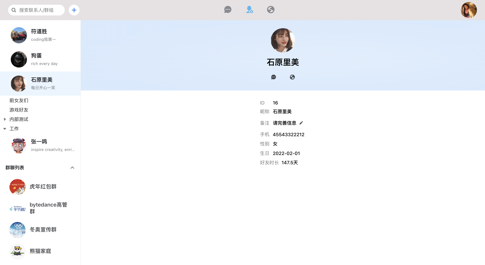
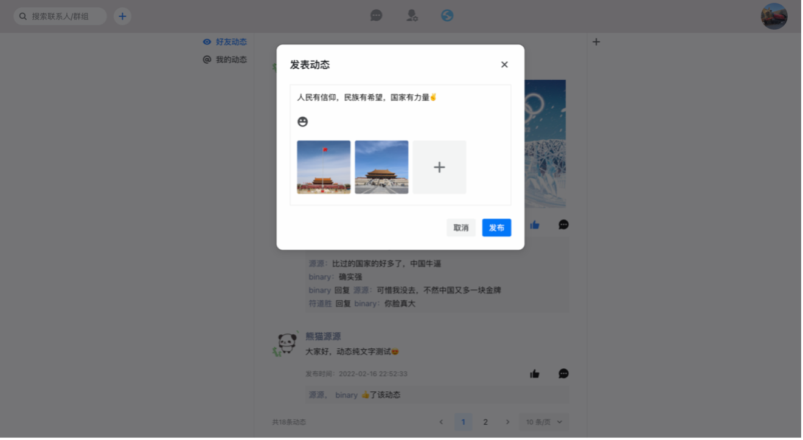
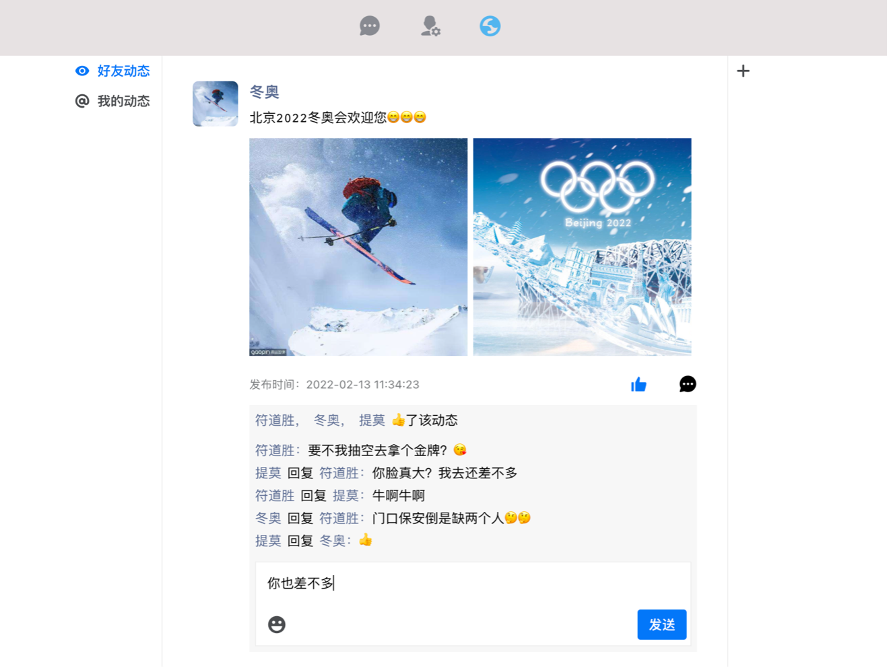
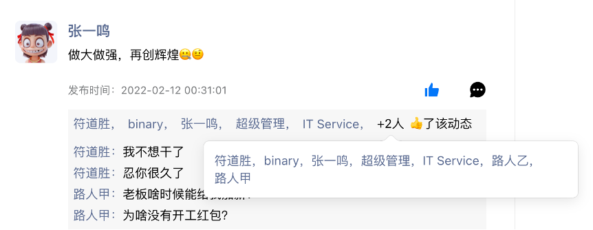

# chat_system|即时聊天系统

## 前言
本系统代码均为个人原创，若在网上发表请指明出处。系统开源目的只是为了供技术爱好者学习、交流，如果你觉得本项目不错麻烦点个收藏（star），这也会激励我持续维护本项目:thinking:。

## 系统技术栈：
***前端主要技术栈：*** React、TypeScript、WebSocket API、semi-ui、axios、immer、sass等。

***后端主要技术栈：*** Node.js、Koa、mysql2、ws、koa-router、@koa/multer、jsonwebtoken、koa-bodyparser等。

## 系统主要功能
1. ***注册登陆模块：*** 用户注册及登陆，token签发、认证等。
2. ***个人信息模块：*** 个人信息的增删查改等。
3. ***联系人管理模：*** 添加好友、查看添加好友记录、修改好友备注、查看好友信息等。
4. ***群聊管理模块：*** 实现入群申请、邀请好友入群、入群申请处理、修改群公告、查看群聊信息等。
5. ***聊天模块：*** 实现单聊/群聊，支持文字、图片、emoji表情。
6. ***朋友圈模块：*** 支持发表动态，查看好友动态，对动态进行点赞、评论。

## 系统预览
聊天|发送emojo|个人信息
---|:--:|---:
||

添加联系人|好友申请信息|添加好友记录
---|:--:|---:
||

入群记录|好友申请信息|添加好友记录
---|:--:|---:
||

动态列表|好友申请信息|添加好友记录
---|:--:|---:
||